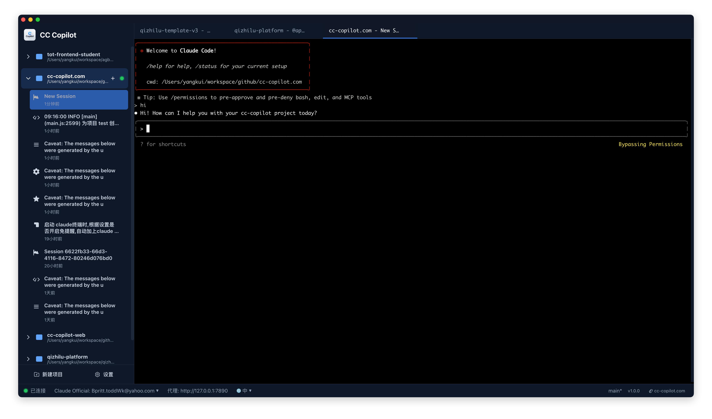

# CC Copilot

多项目、多会话、多账号管理的 Claude Code 桌面客户端。

CC Copilot 是一个专业的 Claude Code 桌面图形界面应用，核心特点是**多项目/多会话管理**和**多账号/多渠道快速切换**。无需退出 Claude 命令就能瞬间切换不同的账号、API 渠道或项目环境，让您的 AI 开发工作流更加高效流畅。

## 软件截图


## 软件下载
 - 请访问官网下载最新版本：[CC Copilot 官网 https://cc-copilot.com](https://cc-copilot.com)

## 核心优势

### 🚀 多账号/多渠道热切换
- **无缝切换**：无需退出 Claude 命令，一键切换不同 API 账号
- **多渠道支持**：同时管理官方 API、第三方代理、Kimi K2、Qwen Coder等
- **实时生效**：切换后立即生效，无需重新启动Claude Code或重新登录

### 📊 多项目/多会话管理
- **项目隔离**：不同项目的对话完全独立，避免上下文混乱
- **会话持久化**：所有对话历史自动保存，随时恢复
- **可视化管理**：左侧面板清晰展示项目结构和会话列表
- **快速导航**：点击即可在任意项目和会话间跳转

### 🎯 专业开发体验
- **终端集成**：内置专业终端，支持所有 Claude Code 功能
- **代理智能路由**：自动处理网络代理，解决连接问题
- **设置同步**：所有配置自动保存，重启应用状态不丢失
- **一键启动**：双击打开，无需复杂的命令行配置

## 主要功能

### 🔀 账号和渠道管理
- **多账号配置**：同时管理多个 Claude API 账号
- **渠道快速切换**：官方 API、第三方代理、Kimi K2、Qwen Coder 一键切换
- **热切换技术**：无需退出当前对话，瞬间切换到不同渠道
- **独立配置**：每个渠道的设置和历史记录完全独立
- **专用代理**：支持设置代理后，每次启动会话自动开启代理

### 📁 项目和会话管理
- **多项目支持**：按工作目录自动分类管理项目
- **会话树结构**：每个项目下可创建多个独立会话
- **历史记录保持**：所有对话内容永久保存，随时查看，并再次对话

### 💻 专业终端体验
- **内置终端**：无需切换应用，直接在界面内操作
- **完整功能支持**：支持所有 Claude Code 命令和快捷键
- **实时交互**：与 AI 的对话实时显示，体验流畅
- **多会话并行**：可同时打开多个终端会话

## 适用场景

- **多项目开发者**：需要在不同代码项目间频繁切换，每个项目需要独立的 AI 对话上下文
- **多账号用户**：拥有多个 Claude Code 账号或需要使用 Kimi K2、Qwen Coder 等其他不同 API 集成到Claude Code

## 快速开始

1. **首次启动**：打开应用，会自动检测 Claude Code 工具
2. **配置账号**：自动检测并配置已安装的 Claude Code 账号、可以添加第三方渠道如：Kimi K2、Qwen Coder 等的 api 和 key
3. **创建项目**：点击左上角 "+" 按钮，选择项目文件夹
4. **开始对话**：应用会自动创建会话并启动 Claude Code
5. **切换渠道**：在状态栏或设置中一键切换不同账号/渠道
6. **管理会话**：在左侧面板中查看和管理所有对话记录

## 系统要求

- **操作系统**：Windows 10+、macOS 10.14+、Ubuntu 18.04+
- **必要条件**：需要预先安装 Claude Code 工具
- **网络**：需要网络连接访问 Claude Code，如果使用官方账号，需要保证本机IP或者代理IP可以正常登录和使用Claude Code

---

## 技术文档

### 技术架构

**应用框架**
- **Electron**: 跨平台桌面应用框架
- **React + TypeScript**: 现代化前端界面
- **Tailwind CSS**: 响应式样式框架

**核心组件**
- **xterm.js**: 专业终端模拟器
- **node-pty**: 伪终端进程管理
- **express**: HTTP代理服务器
- **electron-store**: 本地数据存储

### 开发部署

```bash
# 安装依赖
npm install

# 开发模式
npm run dev

# 构建应用
npm run build

# 平台打包
npm run build:mac   # macOS
npm run build:win   # Windows  
npm run build:linux # Linux
```

### 架构设计

**主进程 (Main Process)**
- `main.ts`: 应用入口，窗口管理，IPC通信
- `proxy.ts`: HTTP代理服务器 (端口: 31299)
- `pty-manager.ts`: 终端进程生命周期管理
- `store.ts`: 数据存储和持久化
- `settings.ts`: 应用配置管理

**渲染进程 (Renderer Process)**
- `App.tsx`: 主应用组件，状态管理
- `SessionList.tsx`: 项目和会话列表
- `Terminal.tsx`: 终端界面组件
- `StatusBar.tsx`: 底部状态栏

### 数据存储

**存储位置**
- **macOS**: `~/Library/Application Support/cc-copilot/`
- **Windows**: `%APPDATA%/cc-copilot/`
- **Linux**: `~/.config/cc-copilot/`

**数据文件**
- `settings.json`: 用户设置和配置

### 代理配置

系统设置里面支持配置代理地址用于Claude Code发起请求时所使用的代理服务器。

### 许可证

MIT License